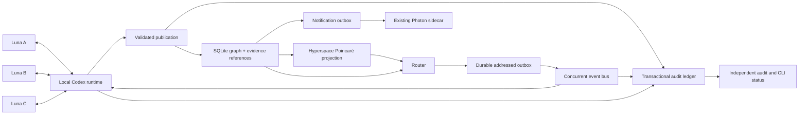
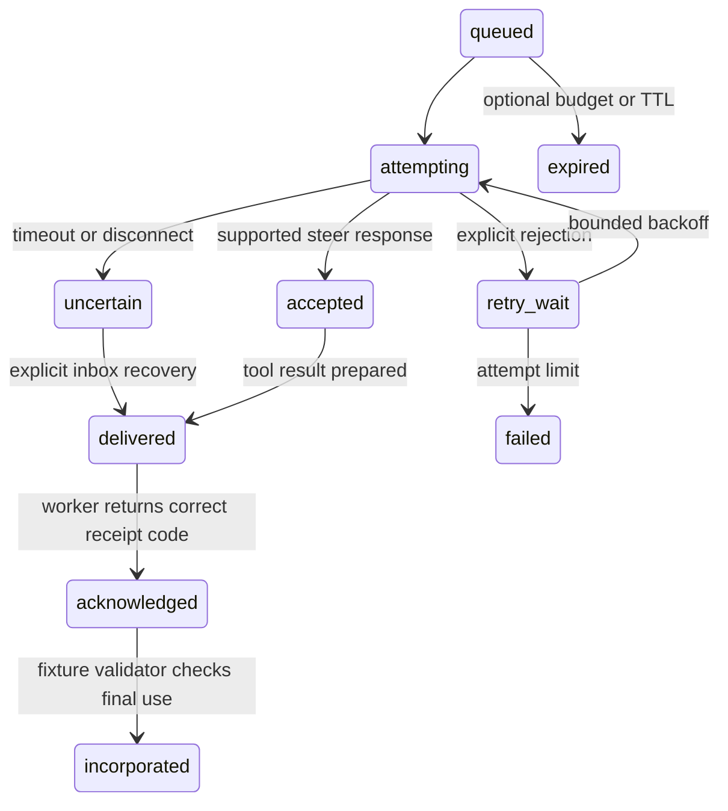

# Architecture and durable state

Three independent Luna conversations share compact typed knowledge through a deterministic host coordinator. Codex app-server is a child process over stdio. There is no remotely exposed app-server WebSocket and no fourth model coordinating the workers.



## Separate representations

1. **Graph topology:** primary parent edges, contradictions, revision links, tasks and evidence associations in SQLite. Scope paths are hierarchy labels, not filesystem paths.
2. **Semantic representation:** deterministic word/bigram hashing in `semantic.py`. It is a lexical baseline behind a replaceable encoder interface, not an externally trained embedding model.
3. **Coordinates:** `path-sector-v1` maps the primary hierarchy to 2D Poincaré coordinates. Coordinate versions persist separately from node text. Text edits do not silently move nodes. Reparenting is explicit and versioned.
4. **Routing:** dependency/owner requirements, priority, verification metadata, graph relationships, lexical score, attention radius, deduplication, context capacity and controlled novelty. Geometry contributes a measured distance; it is not a truth score.

Hyperspace is a rebuildable projection. The coordinator inserts stable worker anchors, publishes knowledge after the canonical commit, and queries the actual server for anchor distances before routing. All three distances must be present in a real-index acceptance run. Missing or corrupt projection records fail clearly or are reconciled from canonical records; there is no silent remote embedding fallback.

The old upstream CDC adapter remains in the lab. The durable inbox polls committed SQLite rows and uses local wakeups for latency because the tested upstream CDC stream has no reliable replay cursor. This change addresses observed recovery requirements; it does not discard the working database or protocol client.

## Knowledge and evidence

`schema.py` defines a versioned event with UUID event/run IDs, fixed event kinds, bounded claims/lists/actions, finite confidence, RFC3339 timestamp, evidence hashes, parents, contradictions, revisions, scope path and explicit recipient dependencies. The host binds author identity to the registered Codex thread. Custom mission tools cannot supply their own author/run identity, credentials, executable commands or arbitrary evidence file paths.

Evidence bytes are written to a private temporary file, synchronized, atomically renamed to their SHA-256 name, and directory-synchronized before a database reference is committed. The canonical graph uses SQLite WAL, `synchronous=FULL`, foreign keys, an explicit schema version and serialized transactions. Interrupted evidence writes can leave unreferenced blobs; they do not intentionally expose a committed reference to an incomplete blob.

Publication and each addressed message have stable IDs. A routing transaction stores both decisions and durable addressed rows; a capacity failure rolls the transaction back. Initial accepted task publication is independent per worker. The bus cannot steer a peer finding into a recipient until that recipient has published its first pass.

## Delivery state machine



The ledger stores these transitions separately. An accepted steer is not a worker acknowledgement. Preparing an inbox response alone is weaker evidence than the worker subsequently returning a private code. The independent audit ties code-bearing ACKs to actual dynamic tool call IDs and final cited peer event IDs.

Steering tasks run concurrently across recipients, with per-recipient reservation locks. Context accounting covers unique accepted, delivered, attempting and uncertain event IDs. Priority and mandatory dependency rules precede optional context. Mandatory over-capacity work remains visible and durable; optional overflow expires with an audit reason. The context allowance is a payload estimate, and the benchmark separately records actual provider token usage.

Explicit tool-input errors have three correction opportunities per worker; rejected call IDs and responses persist. Replaying a rejected call does not rerun host callbacks or consume another opportunity. Unexpected exceptions remain fatal. Incorrect evidence is never corrected by copying the expected answer into a worker response.

## Restart and idempotency

The runtime persists non-ephemeral thread IDs and all three turn-start intents before issuing concurrent calls. Each start includes a correlation marker. After restart, native thread history must identify the corresponding turn. A completed turn can be recovered without another start, and an independently verified still-active turn can be rejoined. Missing or ambiguous history blocks recovery instead of inventing a new turn. Exact timings lost during a crash remain unknown in the audit.

Uncertain tool operations are likewise not blindly replayed. Canonical event IDs and inbox IDs prevent duplicate graph work and counting; an unresolved remote steering outcome can still overlap with an explicit inbox fallback. This is not an exactly-once provider-context claim.

Notification enqueue keys are deterministic. The independent notification database commits outbox state before sending and remembers receipts. Completed-run replay reconciles the required completion notification without re-sending recorded successes. Unknown Photon outcomes are quarantined because the existing provider interface cannot establish exactly-once delivery under a lost response.

The CLI's fresh-process `replay` compares turn, delivery, publication and notification counters before and after reopening the run. Component tests also cover interrupted intents, pending steering, leases, idempotent rejected tool calls, concurrent outbox consumers and persistent database restart. These distinct tests are not a substitute for a destructive power-loss campaign.

## Protocol pinning

The currently installed CLI generated the experimental schemas using:

```bash
codex app-server generate-json-schema --experimental --out astra_harness/protocol/codex-0.153.4
```

`astra_harness/protocol/codex-0.153.4/manifest.json` contains the exact CLI version and schema hashes. `codex_runtime.verify_protocol()` checks them before authentication/model resolution. Preserve the current directory when evaluating a new CLI; generate into a new versioned directory, inspect changed request/response fields, update tests, and only then change the runtime pin. Schema files are definitions, not auth caches.

## Interfaces and limits

`Runtime` owns protocol state only; it calls injected `on_event` and `on_tool` handlers. `KnowledgeStore` is canonical and provider-independent. `HyperspaceBackend` is replaceable behind upsert/search/get/reconcile. `Router` is a pure decision function. `EventBus` manages durable transport and explicit receipt state. `PhotonNotifier` owns its own policy and outbox. `Coordinator` supplies the deterministic acceptance task, while `Mission` supplies bounded custom knowledge tasks and a narrower declared-use audit.

Full-project build verification of the other experimental harness repositories, arbitrary coding tools, learned embedding training, public multi-tenant access, and unbounded autonomous operation are outside this local port's tested scope.
